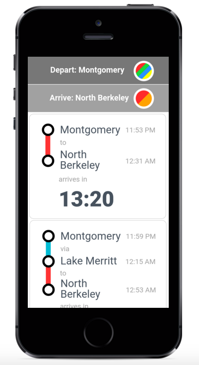
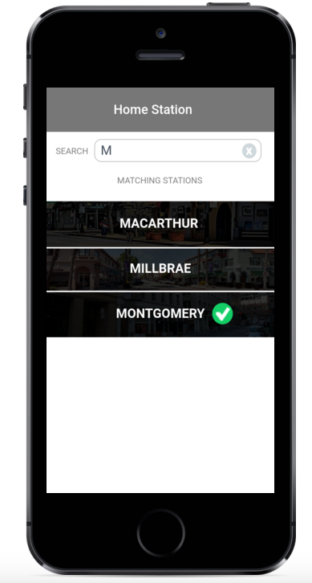

# Screenshots for Sliding Doors




# Stories for Sliding Doors

## MVP:

1. User can set departure station
2. User can set destination station
3. User sees list of stations to choose from for each of the above
4. User sees list of trains that they can ride that conform to those
   stations.
5. List of trains contains ETA at destination

## Second rev:

1. BART Service alert information from Twitter available in an app view.
2. Use location to determine nearest BART station
3. Allow an alarm to be set for when the user nears the destination
   station.

## Third rev:

1. Last BART train alert
2. Settings page that may include Twitter account information to be able
   to tweet out BART issues
3. User can set arbitrary destination and discover nearest BART station.
